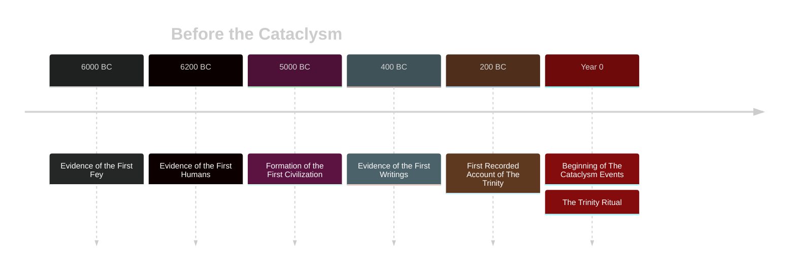
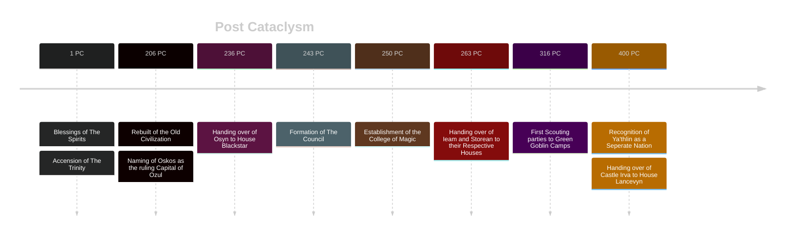
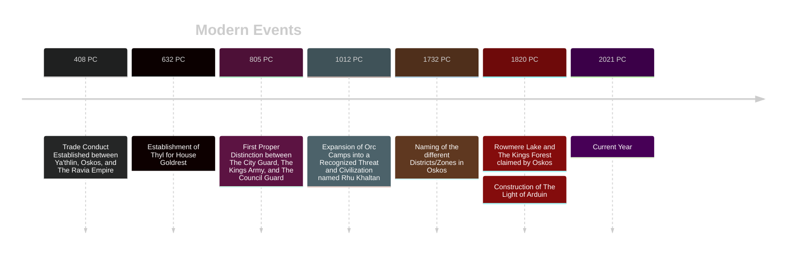

# Before The Cataclysm (BC)
Very little is known about the time before The Cataclysm as much of the history has been lost to time. Written records from this time period are also sparse making it much more difficult to pinpoint certain events with accuracy. Much of the information below is based on expert estimations.

# Post Cataclysm (PC)
The first two centuries after Year 0 are as much a mystery as the time before The Cataclysm. However after the establishment of Oskos, official records became more common place. This allowed easier access to historical writings for future historians.

# Modern Times
Past the golden ages into the stable eras, where most of Oskos workings became solid structures. Major events up to the current year of 2021 PC.

## For Further Reading On Ozul History: [[The Cataclysm]]